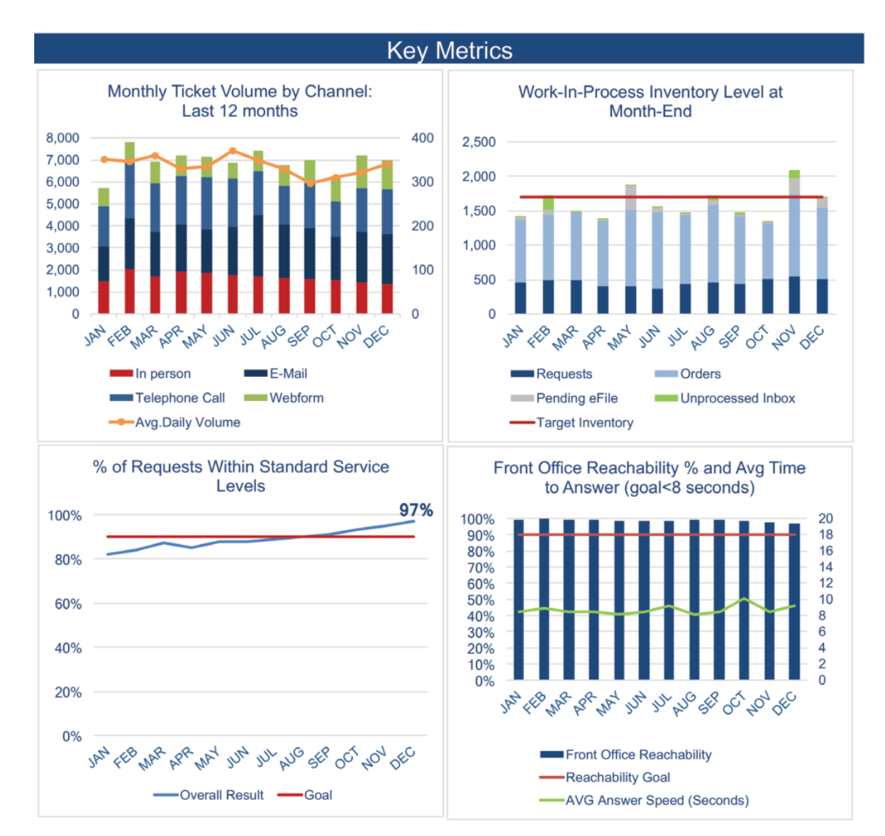

<style>
strong, b {
    font-weight: 900 !important;
    color: #222 !important;
}
</style>

[← Back to Home](../index.html){.btn .btn-outline-secondary .btn-sm
role="button"}

----------------

## Datasets

[Exercise #1 - Twin Genetics](https://calvin-data304.netlify.app/data/twins-genetics-long.json){target="_blank"}

<a href="knaflic-6-11.xlsx" download="knaflic-6-11.xlsx" target="_blank">Exercise #2 - Tickets</a>

<a href="Tanzania.xlsx" download="Tanzania.xlsx" target="_blank">Exercise #3 - Tanzania Fertility Rates</a>

<a href="world_cup_results.xlsx" download="world_cup_results.xlsx" target="_blank">Exercise #4 - World Cup Data</a>


----------------

## Exercise 1: HW #4 Revision

**1. Scroll through the HW 4 Gallery to see the plots we created at that time. Find an example that has that has something you like about it and explain what you like.**

  - One of my favourite graphs from the gallery was Example 2B: "Comparing Kits". I found the main goal of the graph, kit comparison, especially easy to interpret (once the mapping of the color scheme to region was memorized) due to the distinctly clear comparison of genetic share proportion by kit. For instance, for the first set of twins, it was clear that Ancestry "favored" NW Europe over SE Europe or potentially used different geographical definitions.

**2. Find an example that has something you don’t like, and explain what you don’t like about it.**

  - I was unable to see the full value of Example 4B: "Comparing Kits: How Different DNA Tests handle Twins". While I appreciate the attempted use of different shapes, there was a lot of overlap on the graph and a complete lack of notation regarding geographics. While I understand that the point of the graph was to instead compare the similarities/differences between twins, I feel as though the geographical data was lost and the scale of the facets was too small to see the minute differences between twins.

**3. Now create two graphics, one that helps compare the kits and one that helps compare twins. Give your graphics good titles, use use other principles of good visualization, and do not restrict your plot to just a small subset of the data.**

```{r}
library(vegawidget)
```

```{r}

'
{
  "$schema": "https://vega.github.io/schema/vega-lite/v5.json",
  "title": {
    "text": "Do Identical Twins Receive Identical Results?",
    "subtitle": "Points off the diagonal line represent inconsistencies in twin genetic testing results",
    "anchor": "start"
  },
  "data": {
    "url": "https://calvin-data304.netlify.app/data/twins-genetics-long.json"
  },
  "transform": [
    {
      "pivot": "id",
      "value": "genetic share",
      "groupby": ["pair", "kit", "region"]
    }
  ],
  "facet": {
    "column": {
      "field": "kit", 
      "type": "nominal", 
      "title": "DNA Testing Lab",
      "header": {"labelFontSize": 12, "labelFontWeight": "bold"}
    }
  },
  "spec": {
    "width": 160,
    "height": 160,
    "layer": [
      {
        "mark": {"type": "line", "color": "lightgray", "strokeDash": [4,4]},
        "encoding": {
          "x": {"datum": 0}, "x2": {"datum": 1},
          "y": {"datum": 0}, "y2": {"datum": 1}
        }
      },
      {
        "mark": {"type": "point", "filled": true, "size": 60, "opacity": 0.7, "tooltip": true},
        "encoding": {
          "x": {
            "field": "A", 
            "type": "quantitative", 
            "title": "Twin A Share", 
            "axis": {
              "format": "%", 
              "values": [0, 0.25, 0.5, 0.75, 1],
              "labelFontSize": 9
            } 
          },
          "y": {
            "field": "B", 
            "type": "quantitative", 
            "title": "Twin B Share", 
            "axis": {
              "format": "%", 
              "values": [0, 0.25, 0.5, 0.75, 1],
              "labelFontSize": 9
            }
          },
          "color": {
            "field": "region", 
            "type": "nominal", 
            "legend": {
              "orient": "right", 
              "title": "Regions"
            }
          },
          "tooltip": [
            {"field": "pair", "title": "Twin Pair"},
            {"field": "region", "title": "Region"},
            {"field": "A", "title": "Twin A Result", "format": ".1%"},
            {"field": "B", "title": "Twin B Result", "format": ".1%"}
          ]
        }
      }
    ]
  },
  "resolve": {
    "axis": {"x": "independent", "y": "independent"}
  },
  "config": {
    "facet": {"spacing": 10},
    "view": {"stroke": "transparent"}
  }
}' |> as_vegaspec()
  
```

Identical twins provide the perfect control group for testing the reliability of genetic sequencing. Because identical twins share nearly identical genetics, any variation in their ancestry reports is either caused by post-zygotic mutations or a "noise" artifact of the laboratory's algorithm.

This visualization uses a 45-degree identity line to measure this noise. In a perfect system, every colored dot (representing a specific regional genetic share) would sit exactly on the dashed line. However, the scatter plot reveals frequent "divergence", these are shown as points off the line. These represent instances where one twin was told they have a specific heritage while their identical sibling was given a different number.

While this graph is faceted by the genetic testing kit used, it ultimately demonstrates the reported differences in twins. From this fact, we can draw two possible conclusions: 1) *There are high rates of post-zygotic mutations among identical twins*, 2) *While consumer DNA kits are powerful tools, they are not yet precise enough to deliver nearly identical results to individuals with nearly identical DNA*. Therefore, the dispersion seen on the graphs serves either as clear evidence for mutations during post-split development or as a visual margin of error for the entire industry.

```{r}

'
{
  "$schema": "https://vega.github.io/schema/vega-lite/v5.json",
  "title": {
    "text": "Average Interpretation Error by DNA Kit",
    "subtitle": "Average percentage difference between twin results by genetic region",
    "anchor": "start"
  },
  "autosize": {"type": "fit", "contains": "padding"},
  "data": {
    "url": "https://calvin-data304.netlify.app/data/twins-genetics-long.json"
  },
  "transform": [
    {
      "pivot": "id",
      "value": "genetic share",
      "groupby": ["pair", "kit", "region"]
    },
    {
      "calculate": "abs(datum.A - datum.B)",
      "as": "discrepancy"
    },
    {
      "aggregate": [{"op": "mean", "field": "discrepancy", "as": "avg_error"}],
      "groupby": ["kit", "region"]
    }
  ],
  "width": 600,
  "height": 400,
  "mark": {"type": "point", "filled": true, "size": 100},
  "encoding": {
    "y": {
      "field": "region", 
      "type": "nominal", 
      "title": null,
      "axis": {"minExtent": 150} 
    },
    "x": {
      "field": "avg_error", 
      "type": "quantitative", 
      "title": "Avg. Difference Between Twins", 
      "axis": {"format": "%"}
    },
    "color": {"field": "kit", "type": "nominal", "title": "DNA Kit"},
    "tooltip": [
      {"field": "kit", "title": "Kit"},
      {"field": "region", "title": "Region"},
      {"field": "avg_error", "title": "Avg Error", "format": ".1%"}
    ]
  }
}' |> as_vegaspec()

```

While individual results vary, assuming that the discrepancies observed in the previous visualization are primarily a result of testing 'noise' rather than biological divergence, this aggregated view identifies systemic patterns in laboratory interpretation. By calculating the average difference between identical twins across all six pairs, we can measure the noise inherent in genetic testing.

The visualization reveals two primary insights:

  - Precision vs Accuracy: Broad categories (like NW Europe) show high consistency, whereas more specific regions (like SE Europe) show much wider margins of error. This suggests that the "precision" promised by testing labs often comes at the expense of accuracy.

  - Algorithmic Discrepancy: Inconsistency is not uniform. A lab may be highly accurate with one regional marker but struggle with another, proving that results are heavily dependent on a company’s specific internal model.

Simply put, these data points show that a DNA report is not a concrete biological fact, but a variable interpretation. The "DNA story" provided to consumers is highly dependent on the algorithm used to read it.

**4. For each graphic, include a paragraph that tells the story of your graphic.**

  - See above

## Exercise 2: Data and Graphics Challenge

Challenge #4: Tickets

{style="border-radius: 10px;"}
**1.  Write a sentence describing a key takeaway for each graph shown in the report.**

  **a.  Graph #1: Monthly Ticket Volume by Channel: Last 12 Months**

  - While the average daily volume stayed fairly consistent between 300 and 375 tickets the total monthly ticket volume showed large fluctuations in the range of ~5,700 to ~7,800.

  **b.  Graph #2: Work-In-Process Inventory Level at Month-End**
  
  - The Work-in-Progress Inventory level spiked significantly in both May and November, also highlighted by the sudden spikes in 'Unprocessed Inbox', leading to a backlog prior to both the summer and Christmas seasons.

  **c.  Graph #3: % of Requests Within Standard Service Levels**

  - The organization did a great job of steadily increasing the percentage of requests within standard service levels starting from just above 80% in January to 97% by year-end, easily surpassing their goal of 90%.

  **d.  Graph #4: Front Office Reachability % and Avg Time to Answer (goal <8 seconds)**
  
  - Throughout the year, the "Front Office Reachability" stayed remarkably high (consistently above 97%) and the average answer time hovered around 8 to 10 seconds (slightly above the goal of 8 second) suggesting the team maintained solid, open lines of communication.

**2.  Imagine you need to tell a story with this data: which parts of the report would you focus on and which (if any) would you omit? It may be important to look at all of these things as we are exploring the data, but not all of the data is necessarily equally interesting when it comes to communicating it to our audience.**

  **a. Focus on: Challenges to Successes**

  - Graph #3 (% of Requests Within Service Levels): This is the "Hero" metric. It shows steady growth and the team winning as the year goes on.

  - Graph #2 (Inventory Level/Backlog): This is the dramatic piece. It shows the May and November spikes that threatened the team's success.

  - Graph #4 (Reachability/Answer Speed): This is the information that corroborates and complements the story. It proves that even when the backlog was high at times, the front office maintained a high level of reachability.

  **b.  Omit (or De-emphasize):**

  - Graph #1 (Channel Volume): While this information is useful for managers to see how tickets come in, it doesn't add much to the performance story unless one specific channel seemed to cause the failure. For a general audience, other metrics like total volume, are probably enough.
  
  **c.  Use the data to create a webpage or slide deck to tell a visual story with the elements you selected to include in Step 2. Imagine this will be read by someone who is somewhat familiar with the data, but doesn’t deal with on a daily basis. Be sure to include enough text/context to walk them through your story.**

::: {.callout-note appearance="simple"}
## Storyline
Deep dive into the ticket data

[Explore Slideshow](./TicketsStoryline.html){.btn .btn-outline-primary role="button" target="_blank"}
:::

## Exercise 3: A New Challenge

**1. Enter the data into Excel, a CSV, or JSON file. You will have some decisions to make about things like variable names, etc. Be sure to include a link to the data set you create on your portfolio website. Notice that some of the surveys were conducted all in one year and some spanned two calendar years. How will you deal with that?**

  a.  See link above: [Back to Top](#top)
  
  b.  I am going to use a categorical approach by using the full string (e.g., 2015-2016) as a "Nominal" type in Vega-Lite. This preserves the accuracy of the DHS survey period without forcing the data onto a strictly linear timeline that might misrepresent the mid-point.

**2. Use these data to create a visualization that tells a story.**

```{r}
'
{
  "$schema": "https://vega.github.io/schema/vega-lite/v5.json",
  "title": {
    "text": "The Demographic Transition in Tanzania",
    "subtitle": "Comparing Fertility Rates to Modern Contraception Use (1991-2016)",
    "anchor": "start"
  },
  "data": {
    "url": "Tanzania.csv"
  },
  "width": 500,
  "height": 300,
  "encoding": {
    "x": {
      "field": "DHS Survey Year",
      "type": "nominal",
      "sort": ["1991-1992", "1996", "1999", "2004-2005", "2010", "2015-2016"],
      "title": "Survey Period",
      "axis": {
        "labelAngle": 0,
        "labelFontSize": 11,
        "titlePadding": 15
      }
    }
  },
  "layer": [
    {
      "mark": {"type": "line", "color": "#2c7fb8", "point": true},
      "encoding": {
        "y": {
          "field": "Current Use of a Modern Method of Contraception-All Women (%)",
          "type": "quantitative",
          "title": "Modern Contraception Use (%)",
          "scale": {"domain": [0, 60]},
          "axis": {
            "titleColor": "#2c7fb8"
          }
        }
      }
    },
    {
      "mark": {"type": "line", "color": "#e34a33", "point": true},
      "encoding": {
        "y": {
          "field": "Total Fertility Rate, All Women Ages 15-49",
          "type": "quantitative",
          "title": "Total Fertility Rate (Children per Woman)",
          "axis": {
            "titleColor": "#e34a33"
          }
        }
      }
    }
  ],
  "resolve": {"scale": {"y": "independent"}}
}' |> as_vegaspec()

```

**3. Write a few sentences explaining the story told.**

Between 1991 and 2016, Tanzania underwent a significant shift in family planning dynamics. The data reveals an inverse relationship: as the "Current Use of Modern Contraception" climbed steadily from a low of 5.9% to 38.4%, the "Total Fertility Rate" (TFR) dropped from 6.2 to 5.2 children per woman.

The most compelling part of this story is the "Unmet Need." Despite the rise in contraception use, the unmet need for family planning remained stubbornly stagnant (hovering around 22–27%). This suggests that while more women are accessing modern methods, the demand for family planning is growing just as fast as the services are being provided—indicating that there is still significant room for public health intervention to support women's reproductive goals.

**4. Technical notes.**

  a.  Visual Polish: Note that I used Independent Y-Axes in the code above (resolve). This is crucial because "Fertility Rate" is a small number (5-6) while "Contraception Use" is a large percentage (up to 40%). Without independent axes, the fertility line would look like a flat line at the bottom of the graph.

  b.  The "Year" Solution: By using "type": "nominal" and an explicit sort array, you avoid the browser getting confused by the "2015-2016" strings.

## Exercise #4: My Masterpiece

**1. Using a data set of your choosing, create a graphic that demonstrates your abilities to design and create a graphic that tells a compelling story.**

```{r}
'
{
  "$schema": "https://vega.github.io/schema/vega-lite/v5.json",
  "data": {"url": "world_cup_results.csv"},
  "title": {
    "text": "World Cup Winners Evolution",
    "subtitle": "Drag the slider to see how the statistics of the victorious changed over the decades",
    "anchor": "start"
  },
  "params": [
    {
      "name": "YearLimit",
      "value": 2014,
      "bind": {
        "input": "range",
        "min": 1930,
        "max": 2014,
        "step": 4,
        "name": "Show years up to: "
      }
    }
  ],
  "transform": [
    {"calculate": "toNumber(join(split(datum.Attendance, \'.\'), \'\'))", "as": "AttendanceNum"},
    {"calculate": "datum.GoalsScored / datum.MatchesPlayed", "as": "GoalsPerMatch"},
    {"filter": "datum.Year <= YearLimit"}
  ],
  "vconcat": [
    {
      "width": 600,
      "height": 300,
      "mark": {"type": "point", "filled": true, "size": 200, "stroke": "black", "strokeWidth": 1},
      "encoding": {
        "x": {"field": "AttendanceNum", "type": "quantitative", "title": "Total Attendance (of the final)", "axis": {"format": "~s"}},
        "y": {"field": "GoalsScored", "type": "quantitative", "title": "Total Goals Scored"},
        "color": {
          "field": "Year", 
          "type": "quantitative", 
          "scale": {"scheme": "viridis"},
          "legend": {"title": "Tournament Year"}
        },
        "tooltip": [
          {"field": "Year", "type": "ordinal"},
          {"field": "Country", "type": "nominal"},
          {"field": "Winner", "type": "nominal"},
          {"field": "GoalsPerMatch", "type": "quantitative", "format": ".2f", "title": "Goals/Match"}
        ]
      }
    },
    {
      "width": 600,
      "height": 100,
      "mark": {"type": "bar", "color": "#4682b4"},
      "encoding": {
        "x": {"field": "Year", "type": "ordinal", "title": "Tournament Timeline"},
        "y": {"field": "GoalsPerMatch", "type": "quantitative", "title": "Goals/Match"}
      }
    }
  ],
  "config": {
    "view": {"stroke": "transparent"}
  }
}' |> as_vegaspec()

```

**2. Explain the choices you made when designing your graphic and relate them to principles of good graphics that we have learned or seen in this class. Mention alternatives to your graphic that you considered but did not opt to submit.**

  **a.  Principles of Good Graphics (Tufte & Beyond):**
  
  - Composition and Concatenation: I used vertical concatenation (vconcat) to create a "Master-Detail" relationship. The top scatter plot shows the relationship between total goals and attendance (the "volume"), while the bottom bar chart provides a timeline of scoring efficiency (the "quality"). Stacking them allows the reader to see how a specific year's popularity relates to its actual game-play intensity.

  - The Power of Interaction: Following the principle that "Overview first, zoom and filter, then details-on-demand," I implemented a range slider. This allows the user to explore the data chronologically. It demonstrates how the World Cup transitioned from a high-scoring but low-attendance "amateur" era to the modern, professionalized, high-capacity mega-event.

  - Data-Ink and Visual Cleanliness: In accordance with Tufte’s "Data-Ink Ratio," I removed unnecessary chart borders and gridlines. I also used a custom viridis color scale for the years, providing a natural chronological gradient that guides the eye from the oldest tournaments (darker) to the most recent (lighter).

  **b.  Alternatives Considered:**

  - A Static Dual-Axis Chart: I initially considered a single chart with two lines (Goals vs. Attendance). However, the units are so different (millions of people vs. dozens of goals) that the chart became cluttered and confusing. The interactive scatter-bar dashboard is much cleaner and encourages the user to "play" with the history.

  - A Bubble Map: I considered a map showing the location of each World Cup with bubble sizes representing attendance. While visually appealing, it failed to show the "Evolution of the Game" over time as effectively as a timeline-linked dashboard.

**3. Be sure to include information about where you got your data from. This could be a link to a website, a proper citation of an article, a description of a research project you have been working on, etc.**

  a.  Data acquired from: [Tableau Public Datasets](https://public.tableau.com/app/learn/sample-data){target="_blank"}
  
  b.  See link above for the data: [Back to Top](#top)

## Exercise #5: Using your palette

**1. The grammar of graphics gives us a palette of graphical elements with which to “paint” our graphic. The palette includes various marks, channels, composition, etc. One of the goals for your portfolio is that you demonstrate the ability to use a variety of these features and use them effectively. Look over your graphics, and identify a place where you used:**

  **a. an encoding channel other than x or y: ** The first graph of *Exercise #1*, to map the region to color and assign a respective legend.
  
  **b. layers: ** The first graph of *Exercise #1*, to show the dashed gray stroke to emphasize discrepancies.
  
  **c. facets: ** The first graph of *Exercise #1*, the graphs are faceted by DNA kit to more effectively compare both twin and kit results.
  
  **d. concatenation or repeat: ** *Exercise #4*, vertical concatenation to display the relationship between Total Goals and Attendance in the top view, and Goals Per Match in the bottom timeline.
  
  **e. non-default settings for a channel’s scale or guide: ** The graph in part two of *Exercise #3*, the Modern Contraception Percentage on the y-axis is limited to the range of 0 to 60.
  
  **f. tooltips: ** The second graph of *Exercise #1*, the graph has a tooltip to display the kit, region, and average error information for the points on the graph.
  
  **g. another kind of interaction (panning/zooming, brushing, sliders, etc.): ** *Exercise #4*, the dynamic filter controlled by a slider to control the given years up to a certain selected point on the timeline.
  

## Exercise #6: Using your palette

**1. Cite 2 or 3 specific examples in the graphics in your portfolio where you used a feature of Vega-Lite/vegabrite/Altair/altair that we did not learn in class. This might be using a new kind of mark or transform, or a way to customize a feature of the graphic, or a way to use interaction, or…**

  - In Exercise #4, I utilized Advanced Axis Formatting by applying the "format": "~s" shorthand to the Attendance axis. This automatically converts large, cumbersome numbers into a human-readable "SI" format (e.g., turning 3,500,000 into "3.5M"). This level of customization ensures that the "data-ink" is used efficiently, preventing the x-axis from becoming crowded with zeros and keeping the focus on the scale of the tournament.
  
  - In Exercise #4, I encountered a data quality issue where attendance numbers used periods as thousands-separators (e.g., 1.563.135), causing Vega-Lite to misinterpret them as small decimals. I used a nested transform with split and join functions such as "calculate": "toNumber(join(split(datum.Attendance, '.'), ''))" to strip non-numeric characters and cast the result to a quantitative type. This avoided the need for external pre-processing and kept the visualization self-contained.

**2. You will also want to keep learning about principles of good graphics design. Cite 2 or 3 specific examples where you followed the advice in one of the resources from class. Provide specific page (for print or pdf) or section (for HTML) references. Include direct links, if possible. (HTML books often make it easy to link directly to a section.)**

  - Following Edward Tufte's principles in The Visual Display of Quantitative Information (specifically the focus on "Erasing Non-Data-Ink", p. 91-105), I customized the config in nearly all my plots to remove outer view borders ("stroke": "transparent") and unnecessary gridlines. This is most evident in the Twin Genetics scatter plots, where the focus remains on the data points and the identity line rather than the chart's frame.
  
  - In Exercise #3, I followed the advice found in Claus Wilke's Fundamentals of Data Visualization regarding secondary axes (Chapter 3, "Visualizing amounts"). To mitigate the confusion often caused by dual y-axes, I matched the titleColor of the axes directly to the line colors they represent (Blue for Contraception, Red for Fertility). This creates an immediate pre-attentive link for the reader.

## References
Healy, K. 2019. Data Visualization: A Practical Introduction. Princeton University Press. https://socviz.co/.
Heer, Dominik, Jeffrey AND Moritz. 2024. “Mosaic: An Architecture for Scalable & Interoperable Data Views.” IEEE Trans. Visualization & Comp. Graphics (Proc. VIS). https://doi.org/10.1109/TVCG.2023.3327189.
Knaflic, C. N. 2015. Storytelling with Data: A Data Visualization Guide for Business Professionals. Wiley. https://github.com/Saurav6789/Books-/blob/master/storytelling-with-data-cole-nussbaumer-knaflic.pdf.
———. 2020. Storytelling with Data: Let’s Practice! Wiley. https://github.com/Saurav6789/Books-/blob/master/Storytelling%20with%20Data%20Let%
E2%80%99s%20Practice%20by%20Cole%20Nussbaumer%20Knaflic%20(z-lib.org).pdf.
Tufte, Edward R. 2001. The Visual Display of Quantitative Information. 2nd ed. Cheshire, CT: Graphics Press. https://kyl.neocities.org/books/%5BTEC%20TUF%5D%20the%20visual%20display%20of%
20quantitative%20information.pdf.
Wilke, C. O. 2019. Fundamentals of Data Visualization: A Primer on Making Informative and Compelling Figures. O’Reilly Media. https://clauswilke.com/dataviz/.